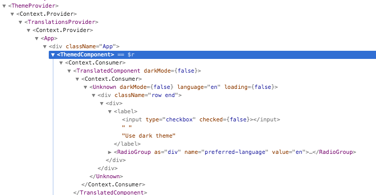
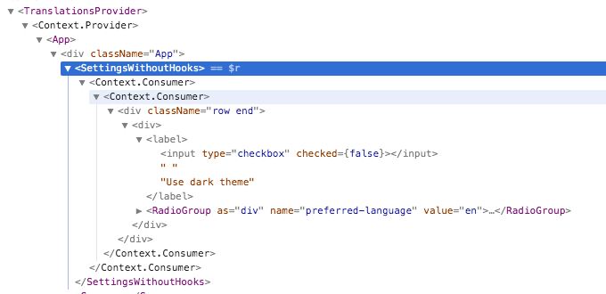
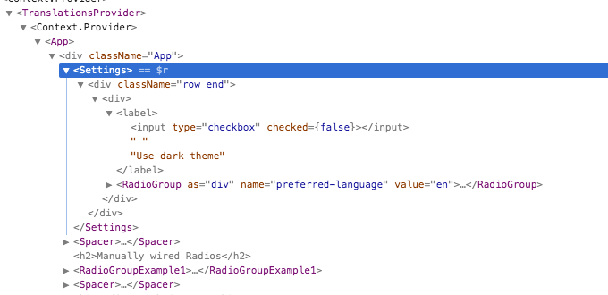

# Moderne React

Viser noen måter å bruke nye features i React. Brukt under fagdag 25.04.2019.

## Hooks

> https://reactjs.org/docs/hooks-intro.html

- Enklere å komponere og dele logikk på tvers av komponenter uten å skape dype komponenttrær
- Kan bruke bl.a. `state` og lifecycle-metoder i funksjonskomponenter
- Hooks kan bare brukes i funksjonskomponenter. Erstatter på mange måter `class`-komponenenter, men begge er fullt og helt støttet!
- Som konvensjon prefikser man hooks med `use` for å visuelt skille dem fra andre funksjoner
- Kan komponeneres på lik linje med vanlige funksjoner:

```js
function useLightBulb(initialState = false) {
  const [state, setState] = useState(initialState);
  const toggle = useCallback(() => setState(state => !state), []);
  return [state, toggle];
}

function App() {
  const [on, toggle] = useLightBulb(false);
  return (
    <>
      Light is {on ? 'on' : 'off'}
      <button onClick={toggle}>Toggle</button>
    </>
  );
}
```

## Context

> https://reactjs.org/docs/context.html

- Mulig å distribuerte data nedover i treet uten å eksplitt sende `props`.
- Kan brukes for "global" data som autentisering, språk, themes, feature flags etc
- Men også for "compounded components" med implisitt tilstand i mellom dem slik som RadioGroup/Radio.

## Error Boundaries

> https://reactjs.org/docs/error-boundaries.html#introducing-error-boundaries

- Håndtere exceptions kastet under render av komponentens barn.

  - _Ikke_ feil som oppstår i event handlere, async kode, server side rendering eller i boundarien selv.

- En komponent blir en Error Boundary ved å implementere `componentDidCatch` enten `getDerivedStateFromError()` (eller begge).
- Kan brukes til å rendre "fallback UIs" når noe går galt
- Feil propageres oppover og håndteres av nærmeste ErrorBoundary (som betyr at man kan ha flere).

## Consuming Context

### 1. Higher-Order Component based on Render Prop



### 2. Render Prop



### 3. Hooks



## Portals

- Rendre til en annen DOM-node fra samme React-tre.

## React.lazy

- Automatisk Code-splitting

## React.PureComponent / React.memo

- Shallow equality checks (optimering)
